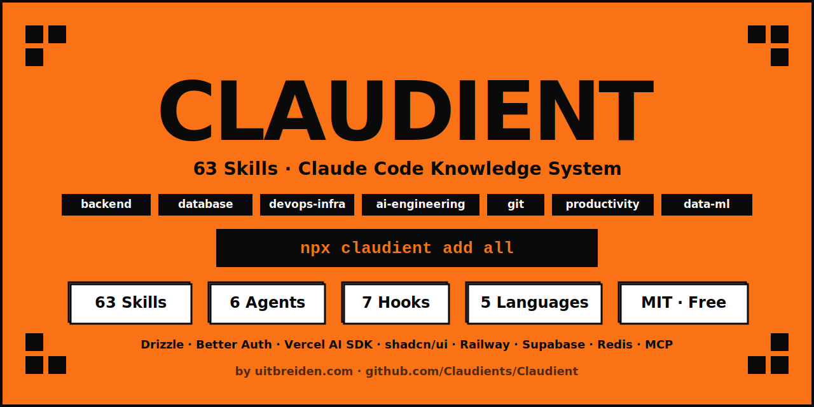

# Claudient — Skills, Agents & Plugins for Claude Code

> The community-powered knowledge system for Claude Code — for developers, vibe coders, AI builders, and small business owners. Activate domain expertise with one command.



[](https://www.npmjs.com/package/claudient)
[](LICENSE)
[](#skills)
[](#-claude-for-small-business)
[](#translations)
[](https://www.reddit.com/r/uitbreiden/)
[](https://www.youtube.com/@UITBREIDEN)

---

## 🏪 Claude for Small Business

> **Not a developer? Claudient has you covered.** These skills are written for business owners — plain English, no terminal commands, works with the tools you already use.

```bash
npx claudient add skills small-business
# Then in Claude Code, just describe what you need in plain English
```

Anthropic launched Claude for Small Business with 15 workflows. Claudient covers the long tail — the workflows they didn't ship:

| Skill | What it automates | Tools |
|---|---|---|
| `/invoice-chaser` | AR reminders, escalation sequences, overdue tracking | QuickBooks, Stripe |
| `/quickbooks-workflow` | Month-end close, reconciliation, discrepancy detection | QuickBooks |
| `/cash-flow-forecast` | 30-day cash position, payroll vs runway warnings | QuickBooks, PayPal |
| `/expense-audit` | Subscription creep, duplicate vendors, unused charges | QuickBooks |
| `/content-repurposer` | 1 brief → blog + social + email + ad copy | Canva, social |
| `/campaign-brief` | Marketing brief → multi-channel execution plan | HubSpot |
| `/review-response` | Draft responses to Google/Yelp reviews, sentiment analysis | Google, Yelp |
| `/customer-inquiry` | FAQ responder + appointment booking after hours | Website, CRM |
| `/shopify-operations` | Product descriptions, inventory alerts, demand forecast | Shopify |
| `/job-description` | Write JD → screen resumes → candidate summaries | Google Workspace |
| `/sop-writer` | Standard operating procedures from plain description | Any business |
| `/weekly-pulse` | Pull KPIs from all tools → weekly business report | Multi-tool |

**Works with:** QuickBooks · HubSpot · Shopify · Stripe · PayPal · Canva · DocuSign · Google Workspace · Square

---

## Who is this for?

Claudient is built for **everyone who uses Claude Code** — from vibe coders and AI product builders to small business owners and GTM teams.

- **Developers & vibe coders** — Next.js + Drizzle + Better Auth, Supabase RLS, Railway, Vercel AI SDK
- **AI product builders** — LangGraph, Mastra AI, MCP Server Builder, Claude API
- **GTM & sales teams** — HubSpot automation, SDR agents, lead enrichment, CRM hygiene
- **Small business owners** — invoicing, cash flow, content, customer service (no code required)
- **Finance & legal professionals** — contract review, DCF models, NDA triage, DSAR response

---

## Quick Start

```bash
# Guided setup (recommended for first time)
npx claudient init

# Or install everything at once
npx claudient add all

# Or install just what you need
npx claudient add skills backend
npx claudient add skills database --lang fr
```

Skills are copied to `~/.claude/skills/`. Restart Claude Code — every skill activates as a slash command.

---

## Run Claude at maximum efficiency

```bash
npx claudient add skills productivity
# Then in Claude Code: /lean-claude
```

The `/lean-claude` skill activates token-efficient mode in one prompt — right model selection, MCP discipline, output compression, subagent strategy. See [`skills/productivity/lean-claude.md`](skills/productivity/lean-claude.md).

---

## ⭐ Most Popular Skills

### Vibe Coding Stack (2026)
The research-validated, AI-legible stack that top vibe coders use:

| Skill | Category | Why it matters |
|---|---|---|
| [Next.js](skills/backend/nodejs/nextjs.md) | backend | File-system routing Claude maps by static analysis alone |
| [Drizzle ORM](skills/database/drizzle.md) | database | TypeScript-first, direct SQL — minimal LLM cognitive load |
| [Better Auth](skills/backend/nodejs/better-auth.md) | backend | Open-source modular auth — prevents dangerous hallucination |
| [shadcn/ui](skills/backend/nodejs/shadcn.md) | backend | Raw component code in repo — Claude reads and modifies directly |
| [Vercel AI SDK](skills/ai-engineering/vercel-ai-sdk.md) | ai-engineering | Streaming AI responses to Next.js — useChat, tools, generative UI |
| [Railway](skills/devops-infra/railway.md) | devops-infra | 2-minute deploys, preview environments per PR |

### Database Layer
| Skill | What you get |
|---|---|
| [Supabase](skills/database/supabase.md) | RLS policies, realtime, auth, storage, Edge Functions |
| [Neon](skills/database/neon.md) | Serverless Postgres, DB branching, pgvector for AI |
| [Prisma](skills/database/prisma.md) | Schema design, nested writes, transactions, middleware |
| [PostgreSQL](skills/database/postgresql.md) | Full-text search, JSONB, pg_notify, PL/pgSQL, asyncpg |
| [Redis](skills/database/redis.md) | Caching, sessions, rate limiting, pub/sub, BullMQ |
| [MongoDB](skills/database/mongodb.md) | Aggregation pipeline, indexes, Atlas Search |

### AI Engineering
| Skill | What you get |
|---|---|
| [Vercel AI SDK](skills/ai-engineering/vercel-ai-sdk.md) | `useChat`, `streamText`, tool calls, multi-provider routing |
| [Claude API](skills/ai-engineering/claude-api.md) | Prompt caching, streaming, tool use, batch, cost optimisation |
| [Mastra AI](skills/ai-engineering/mastra.md) | Agents, workflows, memory, RAG, evals |
| [MCP Server Builder](skills/ai-engineering/mcp-server-builder.md) | Build custom MCP servers to connect proprietary data |
| [Agent Construction](skills/ai-engineering/agent-construction.md) | Multi-agent architectures, orchestrator patterns, handoffs |

### Git Workflow (top-installed skills globally)
| Skill | What you get |
|---|---|
| [Commit Writer](skills/git/commit-writer.md) | Conventional commits from staged diff |
| [PR Description](skills/git/pr-description.md) | Structured PR descriptions with checklist |
| [Changelog Generator](skills/git/changelog-generator.md) | Keep a Changelog from git log + semver guidance |

### Deployment
| Skill | What you get |
|---|---|
| [Railway](skills/devops-infra/railway.md) | Git/Dockerfile deploy, managed DBs, PR previews |
| [Coolify](skills/devops-infra/coolify.md) | Self-hosted PaaS on your own VPS, zero vendor lock-in |
| [Northflank](skills/devops-infra/northflank.md) | Multi-service, secret injection, PR preview environments |
| [Docker Compose](skills/devops-infra/docker-compose.md) | Multi-service local dev stacks, health checks, watch mode |

### Code Quality
| Skill | What you get |
|---|---|
| [Security Audit](skills/productivity/security-audit.md) | OWASP Top 10, severity ratings, specific code fixes |
| [Code Review](skills/productivity/code-review.md) | BLOCKING/IMPORTANT/SUGGESTION framework |
| [Refactor](skills/productivity/refactor.md) | Extract, rename, simplify, remove duplication — with tests |
| [Debug](skills/productivity/debug.md) | Reproduce → hypothesise → narrow → fix → verify loop |
| [Test Generator](skills/productivity/test-generator.md) | pytest/jest with happy path, mocks, and edge cases |

---

## What's included

| Type | Count | What it does |
|---|---|---|
| **Skills** | **63** | Slash commands covering every major stack and workflow |
| Agents | 6 | Planner, Architect, Code Reviewer, Security Reviewer, Build Resolvers |
| Hooks | 7 | Safety guards, auto-format, audit log, cost tracking, session helpers |
| Rules | 8 | Coding standards, git hygiene, security, testing, language-specific |
| Workflows | 5 | Feature dev, debugging, code review, refactoring, project bootstrap |
| Guides | 8 | In-depth docs including CLAUDE.md architecture guide |
| Prompts | 8 | System prompts, project starters, task-specific templates |

All content available in **EN · FR · DE · NL · ES**.

---

## Full Skills by Category

**Skill categories:** `backend` · `devops-infra` · `data-ml` · `database` · `finance-payments` · `ai-engineering` · `git` · `productivity` · `automation`

| Category | Skills |
|---|---|
| `backend/python` | FastAPI, Django, pytest, Python Async, API Design |
| `backend/nodejs` | Next.js, NestJS, React, Vue 3, TypeScript Advanced, Better Auth, shadcn/ui, RBAC, Wasp |
| `backend/go` | Go |
| `backend/dotnet` | C#/.NET |
| `backend/java` | Spring Boot |
| `devops-infra` | Kubernetes, Terraform, Docker, Docker Compose, GitHub Actions, CI/CD, Monorepo, Railway, Coolify, Northflank |
| `data-ml` | Pandas/Polars, PyTorch/TF, dbt, MLflow, Spark, SQL, Data Migration, Synthetic Data |
| `database` | Drizzle ORM, Prisma, PostgreSQL, Supabase, Neon, Redis, MongoDB, GraphQL |
| `finance-payments` | Stripe, Webhook Security |
| `ai-engineering` | Claude API, Vercel AI SDK, Agent Construction, Mastra AI, MCP Server Builder |
| `git` | Commit Writer, PR Description, Changelog Generator |
| `productivity` | Lean Claude, Caveman Mode, Batch Orchestration, Env Doctor, README Generator, Test Generator, Security Audit, Code Review, Refactor, Debug, Test Factories, no-slop, llms.txt |
| `automation` | Browser (Playwright) |

---

## CLI Reference

```bash
# First-time setup
npx claudient init                          # guided 5-step interactive setup

# Install skills
npx claudient add skills                    # all skills (English)
npx claudient add skills backend            # one category
npx claudient add skills database --lang fr # French translation

# Install other content
npx claudient add agents                    # copies to ~/.claude/agents/
npx claudient add hooks                     # copies .sh scripts to ~/.claude/hooks/
npx claudient add rules --write             # appends all rules to ./CLAUDE.md
npx claudient add all                       # skills + agents + hooks
npx claudient add all --lang de             # everything in German

# Search (63 skills indexed)
npx claudient search "better auth"
npx claudient search "database branching"
npx claudient search fastapi

# Manage
npx claudient remove skills backend
npx claudient update                        # check for newer version
npx claudient list                          # browse all content
npx claudient list skills                   # skills only
```

**Supported languages:** `en` (default) · `fr` · `de` · `nl` · `es`

---

## Agents

Spawn specialists with the `Agent` tool using `subagent_type`:

- **Planner** — decomposes tasks into steps before coding begins
- **Architect** — reviews system design and makes structural decisions
- **Code Reviewer** — thorough PR review with security and performance focus
- **Security Reviewer** — dedicated security audit with OWASP coverage
- **Python Build Resolver** — diagnoses and fixes Python dependency errors
- **TypeScript Build Resolver** — resolves TypeScript compilation failures

---

## Hooks

| Hook | Event | What it does |
|---|---|---|
| `block-dangerous.sh` | PreToolUse | Blocks `rm -rf /`, fork bombs, and other destructive commands |
| `git-push-confirm.sh` | PreToolUse | Warns before any `git push`, blocks force push to main |
| `audit-log.sh` | PostToolUse | Logs every tool call to `.claude/logs/audit.log` |
| `prettier.sh` | PostToolUse | Auto-runs Prettier after every Write/Edit |
| `cost-tracker.sh` | PostToolUse | Tracks token usage and estimated cost per session |
| `pre-compact-save.sh` | PreCompact | Saves session state before context compaction |
| `session-start.sh` | Notification | Prints branch, uncommitted files, and session notes on start |

```bash
npx claudient add hooks
# See each hook's .md file for the settings.json entry
```

---

## Rules

```bash
npx claudient add rules --write   # appends all rules to ./CLAUDE.md
```

**Available rules:** Coding Style · Git · Security · Testing · Performance · Python · TypeScript · Go

---

## Workflows

- `feature-development` — idea → scoped → coded → reviewed → merged
- `debugging-session` — reproduce → isolate → fix → verify
- `code-review` — structured review with security and performance checks
- `refactor-safely` — incremental refactoring with test coverage at every step
- `new-project-bootstrap` — scaffold with the right structure from day one

All 5 workflows in EN / FR / DE / NL / ES.

---

## Guides

| Guide | What it covers |
|---|---|
| [Getting Started](guides/getting-started.md) | Setup, first skill, first hook |
| [CLAUDE.md Architecture](guides/claude-md-architecture.md) | Structuring CLAUDE.md for solo/team/monorepo |
| [Skill Authoring](guides/skill-authoring.md) | How to write a skill that actually works |
| [Token Optimization](guides/token-optimization.md) | Model selection, context math, cost reduction |
| [Memory Management](guides/memory-management.md) | Session persistence, compaction strategies |
| [Security](guides/security.md) | Isolation, approval boundaries, sanitization |
| [Agent Orchestration](guides/agent-orchestration.md) | Subagent patterns, parallelization |
| [Hooks Cookbook](guides/hooks-cookbook.md) | Hook patterns with real examples |

---

## Manual installation

```bash
git clone https://github.com/Claudient/Claudient.git
cd Claudient

# Copy a specific skill
cp skills/database/drizzle.md ~/.claude/skills/

# Symlink all skills (auto-updates with git pull)
bash scripts/link-skills.sh
```

---

## Translations

Every skill, guide, workflow, agent, and prompt is available in:

| Language | Code |
|---|---|
| English | `en` (default) |
| Français | `fr` |
| Deutsch | `de` |
| Nederlands | `nl` |
| Español | `es` |

---

## Contributing

See [CONTRIBUTING.md](CONTRIBUTING.md) — includes the skill template, quality checklist, and review process. Join the conversation on [GitHub Discussions](https://github.com/Claudient/Claudient/discussions).

---

## Work With Us

Claudient is backed by [Uitbreiden](https://uitbreiden.com/) — we build AI products with developer communities and deliver B2B AI solutions.

**[uitbreiden.com](https://uitbreiden.com/) · [Reddit](https://www.reddit.com/r/uitbreiden/) · [YouTube](https://www.youtube.com/@UITBREIDEN)**

---

## License

MIT
